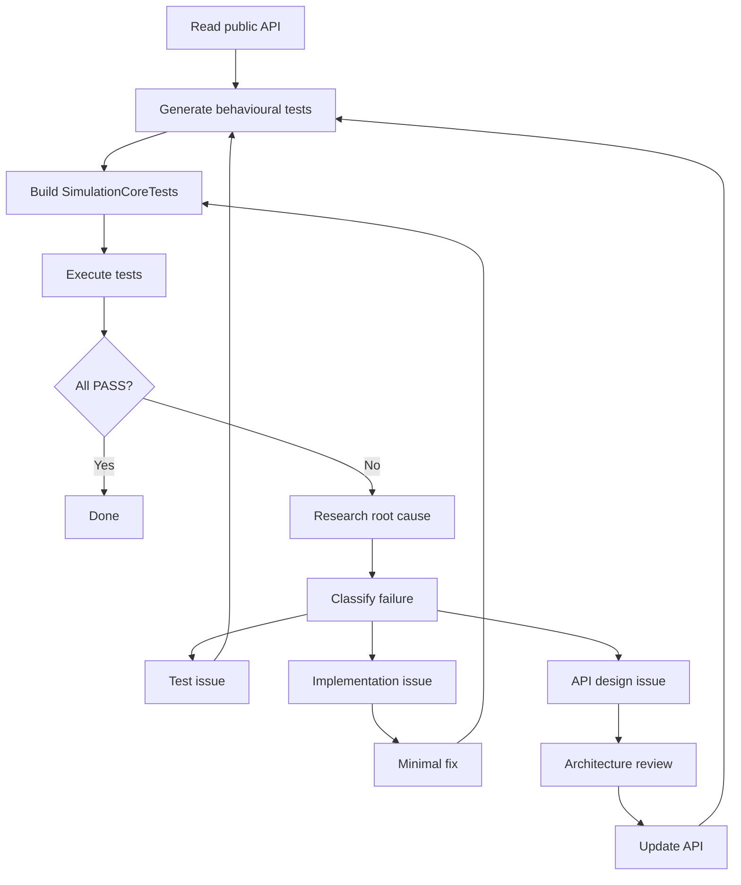

# Transport v1 — Complete ✅ (tag: `transport-v1-complete`)

## Final Architecture

```
Layer           Domain         Decision
─────────────────────────────────────────────
Economy         WHY            requests movement
Route planner   WHERE          immutable execution plan
Controller      WHAT STAGE     state machine + lifecycle
Dispatcher      WHEN           priority + age-based selection
Carrier         HOW            spatial execution only
Telemetry       IS IT HEALTHY  passive observation
```

Route planner(`FindPath`) builds an immutable route at `CreateTask` time.
No code changes route after creation (except `RetryBlockedTasks` rebuilds it).
Controller owns all state transitions via `SetTaskState` (single point, `transitionCount` guard).
Dispatcher(`PickNextTask`) selects among waiting tasks; never touches route/hopIndex/targetFlag.
Carrier moves spatially toward `targetFlag`; never reads route, never modifies task.
Telemetry(`LogTelemetry`) scans state every 600 ticks, `assert oldestWaitingAge < 10000`.

## Key Architectural Decisions

1. **Route = immutable execution plan** — built once at `CreateTask`, never mutated.
2. **One task = one physical unit** — no `amount` field, no batching at task level.
3. **Event-driven lifecycle** — no per-frame scanning, all state transitions from `Notify*` callbacks.
4. **Carrier is a dumb executor** — knows only `targetFlag`, never `route[]` or task state.
5. **Age-based anti-starvation** — `ageBonus = min(tick - createdTick, 200)` computed on selection.
6. **Telemetry = passive observation** — `LogTelemetry()` never modifies state.
7. **transitionCount < 64** — catches infinite state loops.
8. **`Update()` is NOT a decision loop** — exists only for telemetry
   (`LogTelemetry` every 600 ticks) and monotonic tick increment
   (`m_currentTick++` for age bonus). Assignment, route mutation,
   retries, and state transitions remain event-driven from `Notify*`
   callbacks only. See `TransportController::Update()`.

## Build Config
- **Platform**: Xbox 360 (C++03, no variadic templates, `std::function`, auto, range-for)
- **SDK**: Not available for local builds — correctness by code review only

# Render Pipeline — Architectural Invariants

## Seven rules

```
1. Simulation  →  never knows about Rendering.
2. Presentation  →  never knows about Graphics API.
3. Projection  →  the only place world becomes screen.
4. swap()  →  the only frame publication boundary.
5. After swap()  →  RenderFrame is immutable.
6. RenderGraph  →  the sole owner of pass execution order.
7. Pass  →  only receives RenderFrame, RenderContext, CommandBuffer.
```

## Derived invariants

```
Presentation reads Simulation, writes RenderFrame.
After swap(), only RenderGraph reads RenderFrame.
No Pass may reference a Simulation Manager, Controller, Map, or FrameContext.
Infrastructure services (TextRenderer, FontService) are permitted in Pass.
```

## Core assignment (Xbox 360 target)

```
Core2      AI
Core1      Simulation  →  Presentation  →  Projection  →  Publish(RenderFrame)
Core0      Acquire(RenderFrame)  →  RenderGraph  →  CommandBuffer  →  GPU
```

The `swap()` call is the sole publish point. Everything before it is Core1 work;
everything after it is Core0 work. No shared mutable state crosses this boundary.

`RenderFramePublisher` (Stage 9) replaces the direct `swap()` to formalize the
handoff, but changes nothing else in the pipeline.

## Projection invariant

```
Projection is deterministic.
Given the same RenderFrame + Camera snapshot → bit-identical projected frame.
No dependency on time, GPU state, or pass order.
```
Same RenderFrame + Camera → бит-идентичный output.

# Architecture — Cycle 2 Complete ✅ (tag: `architecture-cycle-2`)

## Domain First

Domain types and entities are the only stable source of truth. Rendering, UI, localization, metadata and serialization are projections of the domain model and must never become the primary source of game state.

## Milestone: Unified Domain Model

Two parallel migration lines converged:

```
Logistics:  EconomyManager → DemandManager → DemanTicket → Carrier → CargoManager
            (single source of truth for routing)

UI:         Game → MenuBuilder → MenuModel → RadialMenu → UiAction → Game
            (single source of truth for menu content)
```

## Completed

- **UI1** — `UiMessageId` enum + `LocalizationService` (2D table, `Get`/`Format`)
- **UI2** — `NotificationManager` (fixed pool, ID-based `Notify`, `FillFrameContext`)
- **UI3** — `StatusManager` (persistent status, decay timer, ID-based)
- **UI4a** — All 6 `UiEventSystem` event handlers migrated to `NotificationManager`; `GetResourceName()`/`GetBuildingName()` → `GetResourceNameId()`/`GetBuildingNameId()`
- **UI4b** — Dead confirm system fully removed: `IUiInputHost`, confirm fields, GameRenderer confirm block, `"A = Yes B = No"`
- **UI5a** — MenuModel + MenuScene: `MenuItem { labelId, enabled, action }`, `ICommandDispatcher`, zero user-facing string literals
- **UI5b** — GridMenu migrated to MenuModel + UiAction; building labels → UiMessageId
- **UI5c** — RadialMenu migrated: `std::wstring name` → `UiMessageId labelId`; `int typeId` → `UI::UiAction action`; selection delegates to internal `MenuModel`; sync asserts added
- **Logistic PR 1** — Carrier no longer decides cargo destination: `GetDemandTarget`/`GetNextHop` routing → `HasDemand(type)` wake-up only
- **Logistic PR 2** — `DemandTicket` fixed pool (256): `AllocSlot()`/`FreeSlot()`, `assert` on exhaustion + double-free
- **Logistic PR 3** — `destFlagId` audit: proven as ownership tag (not routing); `ResourceDeliveredData::destFlagId` removed (dead); `GetDemandTarget()` removed (0 callers)
- **PR 1** — `BuildingState` enum removed (was always `BS_DONE`)
- **PR 2** — `Building::state` field removed; 13 always-true guards removed; dead `constructionMaterials`/`deliveredMaterials` removed

## Current Layer Stack

```
Gameplay → UiMessageId → NotificationManager/StatusManager → LocalizationService → UiFrameState → GameRenderer
publishes IDs                    stores IDs                    resolves text          DTO              reads only
```

## Component Responsibility Map

| Subsystem | Single Source of Truth | Domain Type(s) |
|-----------|----------------------|----------------|
| Construction | `ConstructionSite` | — |
| Building | Invariants (no `state` field) | — |
| Logistics (routing) | `TransportTask` | `TransportTask` |
| Logistics (stationary) | `ResourceSlot::destFlagId` (ownership tag) | `Flag` |
| UI Menu content | `MenuModel` | `MenuItem`, `UiAction` |
| UI Menu view | `RadialMenu` / `GridMenu` | Geometry, sprites, animation |
| User action | `UiAction` | `UiAction` (command + value) |
| Localization | `LocalizationService` | `UiMessageId` → `char[]` |
| Notifications | `NotificationManager` | `UiMessageId` |
| Status line | `StatusManager` | `UiMessageId` |

## Architecture Audit

### Zero UI string literals in gameplay core (post UI4b)

| File | Before | After |
|------|--------|-------|
| `InputController.cpp` | ~15 raw status text | **0** |
| `RoadController.cpp` | ~6 raw road messages | **0** |
| `GameScene.cpp` | ~5 raw confirm/banner | **0** |
| `GeologistController.cpp` | ~15 raw geologist text | **0** |
| `GameRenderer.cpp` | ~30 confirm block | **0** |
| `UiEventSystem.cpp` | ~53 (6 handlers) | **0** |

### String literals remaining (non-UI)

| Category | Where | Status |
|----------|-------|--------|
| UI text (localized) | `LocalizationService.cpp` (~188) | ✅ Centralized |
| Asset names (sprites/atlas) | `GameRenderer.cpp`, `GameScene.cpp`, `RoadController.cpp`, `MenuBootstrap.cpp`, etc. | ✅ Not UI text |
| Debug/log | `SceneManager.cpp`, `InputController.cpp`, `WorldBootstrap.cpp`, `CarrierSystem.cpp` | ✅ Diagnostics only |
| Editor/Menu UI | `EditorScene.cpp`, `TilePalette.cpp` | ⏳ UI6 target (~268 literals) |

## Transport Contract (Architectural Invariants)

### Rule 1 — TransportTask owns the shipment lifecycle

> **TransportTask owns lifecycle. No other object may create, route, deliver or cancel a shipment.**
> Economy observes shipment completion through `observerTicketId` and never participates in transport execution.

```
CreateTask → Assign → PickUp → AdvanceHop → Delivered → DemandManager::Deliver()
                                                      → Cancel → DemandManager::CancelTicket()
```

**Violation**: any code outside `TransportController::CreateTask`, `SetTaskState`, or `DeliverTask`
that modifies task state or completes/cancels a shipment without going through the Controller.

### Rule 2 — Single mutable representation

> **TransportTask is the only mutable representation of a shipment.**

```
DemandManager  →  observerTicketId (read-only observation)
TransportTask  →  owns all mutable state
Cargo          →  physical representation (resource + ownerTask)
Carrier        →  execution state only (what they carry, where they walk)
```

- `DemandManager` creates the request, never mutates transport state.
- `TransportTask` stores everything: route, hopIndex, cargo link, carrier link, state.
- `Cargo` stores only physical identity (resource type) and back-link to its task.
- `Carrier` stores only execution state: what it's carrying and where it's heading.
- `DemandManager` receives only final notification via `observerTicketId`.

**Violation**: modifying a shipment's route, state, or destination from anywhere
other than `TransportController` member functions.

### Rule 3 — Ownership chain (no DemandTicket in transport)

> **DemandTicket is an adapter at the economy boundary. Transport never sees it.**

```
Economy boundary:
  DemandManager → Reserve() → DemandTicket → observerTicketId on TransportTask

Transport core:
  TransportTask → Cargo (ownerTask) → Carrier (targetFlag)
```

`Cargo` no longer holds a `DemandTicket*`. The ownership chain is:

```
Ground
  → Flag inventory (stationary via ResourceSlot::destFlagId)
    → TransportTask (in transit, owns lifecycle)
      → Carrier (spatial executor, knows only targetFlag)
        → Building inventory (consumed)
```

**Violation**: a `Cargo` containing a `DemandTicket*`, or any transport code
calling `DemandManager::Reserve()`/`ReleaseTicket()` directly.

### Acceptable transitional state — `Ground|Task`

After `CreateTask()` and before `PickUp()`, a resource is physically on the
ground/flag but logically owned by a TransportTask. The telemetry mask
`Ground|Task` is **correct** — ownership precedes physical pickup.

This is not a violation. The invariant is: before PickUp the physical location
and logical owner may differ; after PickUp they must converge (Carrier carries).

### Architectural boundaries

#### Route vs Dispatch (Phase 7.4)
> **Route planner decides WHERE cargo moves.**
> **Priority dispatcher decides WHEN cargo moves.**
> The dispatcher (`PickNextTask`) selects among waiting tasks but never modifies
> route, hopIndex, or targetFlag. These responsibilities must never be mixed.

#### Economy vs Transport (Phase 8)
> **Economy requests movement. Transport performs movement.**
> Economy never moves resources directly.
> DemandTicket lives at the boundary as an adapter — it connects DemandManager's
> request to TransportTask's lifecycle, then drops out of the model.

---

### Roadmap (updated)

```
Transport Complete
        │
        ▼
RenderFrame becomes the only visual source
        │
        ▼
Old renderer removed
        │
        ▼
Visual World Verification (T1–T8)
        │
        ▼
Remove legacy transport (Phase 8.4)
        │
        ▼
Cycle 3 — Definition Pattern
```

# Phase 8 Migration Checklist

## 8.1 — Demand → TransportTask adapter (bridge)
- [ ] DemandManager creates TransportTasks (old pipeline still alive)
- [ ] Invariant: one Demand = at most one active TransportTask
- [ ] CargoManager reports delivery completion to DemandManager

## 8.2 — Resource ownership migration
- [ ] Ownership chain enforced: Ground → Flag → Task → Carrier → Building
- [ ] Runtime audit: `[Resource] id=712 owner=TransportTask(17)` (debug)
- [ ] Remove old ownership paths (Reserve/Allocate)

## 8.3 — Parallel validation mode
- [ ] old TransportJobManager = observe only
- [ ] new TransportController = execute
- [ ] Log: `[MIGRATION] demand=81 old=flag12 new=flag12 OK`

## 8.3.5 — Soak tests (destructive first)
- [ ] T4: Road break — retry blocked tasks, no orphaned TransportTask/Cargo
- [ ] T5: Flag deletion during active transport — cancel task, restore demand, no Cargo leak
- [ ] T6: Cancel during PickUp
- [ ] T7: Cancel during Move
- [ ] T2: 10 simultaneous construction sites (producer + consumer scaling)
- [ ] T3: Long road chains — multiple AdvanceHop across 5+ flags
- [ ] T8: 30–60 min gameplay — telemetry clean (mask/res/ownHash/blocked)
- [ ] T1: Full regression — single resource, single carrier (baseline sanity)

## 8.4 — Remove legacy transport
- [ ] All scenarios pass: wood→warehouse, warehouse→construction, mine→smelter, food→worker, blocked recovery, flag deletion
- [ ] Same save → old and new produce equivalent resource distribution (± delivery timing)
- [ ] Remove TransportJobManager, DemandTicket, `kUseTransportJobs`, old Carrier routing
- [ ] Transport tests green

### Equivalence criteria for 8.4

**Strong invariants** (must be identical):
- Final resource counts at each building/flag
- Destination inventories (what arrived where)
- Construction completion (same buildings finish)
- Blocked recovery result (same resources reachable)

**Weak invariants** (allowed to differ):
- Delivery timestamps (timing shifts are fine)
- Carrier identity (who carried is irrelevant)
- Hop count (new route may differ)
- Queue order (priority dispatching reorders fairly)

**Conservation invariant** (global — applies to whole economy):
```
Σ(world resources) before migration
==
Σ(world resources) after migration
```
No resource may disappear, duplicate, or simultaneously belong to two layers.
This holds across all explicit create/destroy events.

**Migration complete** ⇔ new transport produces economically equivalent world state without ownership violations.

---

# Current Status — Full Cycle Verified ✅

## What works (end-to-end confirmed via log analysis)

```
ConstructionSite → DemandManager → TransportController → Carrier → Flag → CheckDeliveries → ConstructionSite → Builder → Completed
```

Full single-site cycle confirmed: Woodcutter at (20,33) — dispatch, walk, build, resource delivery (3/3 Wood), completion, builder return, site removal.

Multi-site with shared roads: Hunter at (18,38) received all 3 Wood via road 2 carrier. Fisher at (24,30) transport chain functional after Reserve fix.

## Recent fixes (Phase 8.3)

| Fix | File | What |
|-----|------|------|
| `HasDemandFromOtherFlag` | `DemandManager.h:41`, `DemandManager.cpp:355` | Carrier idle check skips demands targeting the same flag |
| `Reserve` same-flag filter | `DemandManager.cpp:184-196` | When originFlag > 0, skip demands whose resolved target flag ID matches origin — prevents warehouse demand (priority 10) from blocking construction demand (priority 5) at the same flag |
| Carrier idle uses `HasDemandFromOtherFlag` | `Carrier.h:250` | Prevents wasted wake → walk → Reserve → Release cycles for resources already at their destination |

## Remaining issues

- **OVERDELIVER telemetry** (`delivered=3/1`): artifact of `SetDemand(woodMissing)` overwriting `requested` downward each frame. Harmless — delivery and ticket release complete normally. Fix: log initial amount separately, or don't reduce `requested` in `SetDemand`.
- **Builder dispatch timing**: Builder waits at `"no road to site"` until player builds road. This is correct Settlers behavior — not a bug.

# Stabilization Checklist

## Logistics
- [x] Building receives all required resources (confirmed: Woodcutter 3/3, Hunter 3/3)
- [ ] Production buildings get input resources
- [x] Warehouses collect only truly free resources (Reserve filter prevents same-flag pickup)
- [ ] Flag deletion leaves no orphaned resources
- [ ] No DemandTicket pool asserts triggered
- [ ] No DemandTicket leaks on map clear / return to menu

## Construction
- [x] Open build menu
- [x] Select any building
- [x] Place building
- [x] Wood delivery
- [ ] Stone delivery
- [x] Construction completion (confirmed: Woodcutter, Hunter)

## Known Pre-existing Bugs (not caused by architecture cycle)
- **Construction completion order**: `ConstructionManager::Update()` deletes completed sites before `PostUpdate()` fires `Event_ConstructionComplete`
- **Building placement**: cursor does not change after selecting building icon from build menu (traced through menu selection → EnterBuildMode chain; cause not in PR 1)

---

# Next Steps — Methodology Pipeline

## Current Cycle

```
Model layer (completed in document)
━━━━━━━━━━━━━━━━━━━━━━━━━━━━━━━━━━━
PR12 — Carrier cleaned ✅
        │
        ▼
PR13 — DemandManager Verification ✅
        │
        ▼
PR13.1 — Minimal repair (Demand.h include fix) ✅
        │
        ▼
PR13.2 — Win32 build infrastructure + 94/94 PASS ✅
        │
        ▼
━━━━━━━━━━━━━━━━━━━━━━━━━━━━━━━━━━━
Measurement layer (requires Xbox 360 SDK)

Re-Verification (Xbox 360) ⏳ (expected 94/94)
        │
        ▼
Next subsystem (Verification → Repair → Re-Verification)
```

## Candidate order (by testability score)

| Subsystem | Score | Next step |
|-----------|-------|-----------|
| DemandManager | 4/5 | PR13 ✅ (94/94 PASS on Win32, Xbox 360 re-verify pending) |
| FlagManager | 2/5 | Defer (needs Flag DTO split first) |
| ConstructionManager | 1/5 | Defer (needs decomposition first) |

## Process invariant

```
Verification → Root Cause → Minimal Repair → Re-Verification → Measured Improvement
```

One root cause per cycle. Repair never larger than necessary to eliminate
one confirmed Root Cause.

### Emerging pattern (2 data points)

```
Subsystem       Root cause          Category
─────────────── ─────────────────── ───────────────────────────────────
Transport       Carrier.h → World   Public header carries unnecessary deps
DemandManager   Demand.h → ResourceNode.h  Same
```

Both root causes are not algorithmic complexity — they are **public header
pollution**: the header includes more than the type contract requires.
If 2–3 more subsystems show the same pattern, it becomes a validated
architectural observation about the project's primary source of untestability.

## Three knowledge layers

| Layer | What | Confirmed by | Changes when |
|-------|------|-------------|-------------|
| **Methodological invariants** | Properties of the process itself | Repeatability across independent subsystems | Process stops reproducing |
| **Architectural observations** | Empirical findings about this codebase | Accumulated Verification data | New data contradicts current model |
| **Architectural invariants** | Conscious design decisions | Project charter | Architecture is deliberately changed |

### 1. Methodological invariants (confirmed by process repeatability)

- Verification precedes Repair.
- Repair does not begin without an established Root Cause.
- Verification localizes the problem to one minimal independent cause.
- Re-Verification confirms or refutes the hypothesis.

After two independent cycles (Transport, Demand), these are properties
of the process itself, not of any subsystem.

### 2. Architectural observations (provisional, subject to evidence)

| Evidence level | Criterion | Current status |
|----------------|-----------|---------------|
| **Observation** | 1 independent subsystem | Transport (PR11) |
| **Emerging pattern** | 2–3 independent subsystems | **Current**: Transport + Demand (PR11 + PR13) |
| **Validated architectural observation** | ≥4 independent confirmations | Not yet reached |

**Emerging pattern**: "Public header pollution is the primary source of untestability."
(2 data points — pending confirmation from ≥2 more subsystems.)

### 3. Architectural invariants (design decisions)

```
SimulationCore → no Scene, Graphics, Xbox SDK dependencies
Dependency direction: World → SimulationCore (never reverse)
TransportTask is the single mutable representation of a shipment
```

These are not derived from Verification. They are conscious architectural
constraints. Changed only by deliberate decision.

### Core principle

> **The architecture model is derived from Verification, not imposed on it.**

The model must explain accumulated observations, not constrain future search.
If data contradicts today's assumptions, the model adjusts — the process
does not break.

```diff
- Deductive:  Architecture theory → Verify code
+ Inductive:  Code → Verification → Evidence → Architecture model
```

Do not predefine root cause categories. Each Verification surfaces its own.
Categories emerge from accumulated data, not from prior classification.

## Definition Pattern (Architectural Invariant for Cycle 3)

## Definition Pattern (Architectural Invariant for Cycle 3)

Domain types are the only stable identifiers. UI assets, render assets, metadata and gameplay properties must be obtained from definition tables/services keyed by the domain type. Systems must not derive domain types from resource names (sprite names, icon names, localized strings).

**Permitted:**
```
BuildingType → sprite name
BuildingType → icon name
BuildingType → cost
BuildingType → metadata
```

**Forbidden:**
```
sprite name → BuildingType
icon name   → BuildingType
```

### Precedent in current architecture

| Domain Type | Definition Source |
|-------------|------------------|
| `UiMessageId` | `LocalizationService` (2D enum→string table) |
| `BuildingType` | `BuildingDefinition` (planned: sprite, icon, cost, size, class) |
| `ResourceType` | `ResourceDefinition` (future) |
| `WorkerType` | `WorkerDefinition` (future) |

## Phase 6b — ARCHIVED (Research Prototype)

Phase 6b (`kUseTransportJobs` experiment) successfully identified a fundamental architectural flaw:
> A logistics system needs **one TransportTask per shipment**, not one TransportJob per hop.
> Split responsibility between Job/Cargo/Carrier caused sourceFlag mismatch on intermediate hops.

All lessons and the new architecture are in `docs/LOGISTICS_ARCHITECTURE.md` (FROZEN v1.0).

## Phase 7 — Clean-slate Logistics

**Principle:** TransportController is the sole decision-maker. Carrier only executes PickUp/Walk/Drop.
One `TransportTask` = one physical item, one lifecycle, one id.

See `docs/PHASE7_IMPLEMENTATION_PLAN.md` for detailed phase order.

## Boundary Rules for Future PRs
- Carrier never decides cargo destination — routing decision centralised in TransportController (Phase 7)
- PRs change one architectural aspect each; never combine cleanup with behavioural change
- GameRenderer remains read-only (no mutation of world state)
- UI widgets speak `UiAction`; `ICommandDispatcher` is single execution point
- Dead code removal is consequence, not goal; API surfaces unchanged in architectural PRs
- **Rule during Phase 7**: No features outside `docs/LOGISTICS_ARCHITECTURE.md`. Extensions after stable baseline.

---

# Phase 8 Post-Merge Debugging Session (2026-07-02)

## Problem

After merging `phase-7` into `main` (fast-forward, commit `436b0cd`), a dump.txt log showed:

1. **Builder doesn't visually come out** — builder walking logic worked (logs showed walking, building, returning), but...
2. **Building itself doesn't construct** — construction site scaffolding appeared but final building sprite never replaced it
3. **Worker doesn't go to work** — no Woodcutter worker spawned after building completed
4. **No tree cutting** — no Woodcutter activity after build complete
5. **`activeRequests=1` hangs forever** — EconomyManager's construction request count stuck at 1

## Root Cause — Two Bugs

### Bug 1: Premature site deletion in `ConstructionManager::Update()`

`ConstructionManager::Update()` (`ConstructionManager.cpp:333`) called `RemoveSite(site)` **immediately** when `IsComplete() && builderState == Builder_None`. This deleted the completed construction site in Phase 1 of the frame update. But `ConstructionSystem::PostUpdate()` (Phase 7) was designed to detect completed sites and fire `Event_ConstructionComplete`. Since the site was already deleted, the event **never fired**.

**Fix**: `ConstructionManager.cpp:333-337` — removed the `RemoveSite(site)` call. Now the completed site stays in the vector. `PostUpdate()` detects it, fires `Event_ConstructionComplete`, and the normal event→command chain (`BuildingSystem` → `Cmd_RemoveConstructionSite`) handles cleanup.

### Bug 2: Wrong guard in `BuildingSystem::HandleConstructionComplete()`

`BuildingSystem::HandleConstructionComplete()` (`BuildingSystem.cpp:143`) guarded against double-creation with:
```cpp
if (flag->hasBuilding) return;
```

But `flag->hasBuilding` is already set to `true` at flag creation time (`ConstructionSystem::HandlePlaceFlag` sets it for non-free flags, `ConstructionFactory::Create` does the same). So the guard **always triggered** for newly-built construction sites, preventing building creation, worker spawning, and tile layer setup.

**Fix**: Changed guard to `if (flag->building != NULL) return;`. This correctly distinguishes:
- Flag with a planned building (`hasBuilding=true, building=NULL`) → guard passes, building is created
- Flag with an existing building (`hasBuilding=true, building=non-null`) → guard blocks, prevents double-creation

## What Each Fix Unlocks

| Fix | Effect |
|-----|--------|
| Bug 1 fix | `PostUpdate` fires `Event_ConstructionComplete` |
| Bug 2 fix + Bug 1 fix | `BuildingSystem` creates `Building`, calls `AddToLayer` (sprite appears), `SpawnWorker` (worker walks to building), `AddBuilding` (registers with economy) |
| Both | EconomyManager Phase 8 cleanup sees `flag->building != NULL` and clears stale construction requests → `activeRequests` returns to 0 |
| Worker spawned | Woodcutter starts tree harvesting cycle |

## Remaining pre-existing issues (not caused by merge)
- **OVERDELIVER telemetry** (`delivered=3/1`): harmless artifact of `SetDemand(woodMissing)` overwriting `requested` downward each frame
- **Carrier `sprite=0` when idle**: computed from road slope direction when `walkDir=0.0` — not a bug, correct idle facing

## Files Changed
- `Settlers2/World/ConstructionManager.cpp:333-337` — deferred site removal for completed sites
- `Settlers2/World/Systems/BuildingSystem.cpp:143` — fixed guard from `flag->hasBuilding` to `flag->building != NULL`

### Critical Invariant (from Bug 2)

```
Flag::hasBuilding  == reservation / planned building
Flag::building != NULL == instantiated building object
```

**Never use `hasBuilding` as a check for object existence.** A flag with a planned construction site has `hasBuilding=true` but `building=NULL`. Use `flag->building != NULL` when you need to know whether a `Building` object actually exists.

### Debugging Maturity Signal

The bug pattern across the last few days follows a natural hierarchy:

| Layer | Examples | Status |
|-------|----------|--------|
| **Architecture** | double ownership, DemandTicket vs TransportTask, carrier routing | ✅ Resolved (Phase 7) |
| **Initialization** | Handle vs FlagId mismatch, two ConstructionManager instances, warehouseFlag wiring | ✅ Resolved |
| **Lifecycle** | object deleted before event consumer runs, state flag used for wrong semantic | ✅ Fixed (this session) |

This progression is a strong signal of project maturity — during large refactors, bugs disappear in exactly this order.

## Next: Verify Full Game Loop

Before adding new features, verify the complete cycle for multiple building types:

```
ConstructionSite → Resources delivered → Builder → ConstructionComplete
→ Building created (AddToLayer) → Worker spawned (SpawnWorker)
→ Building starts working (production cycle)
```

### Test checklist

| Building | Resources | Worker type | Production |
|----------|-----------|-------------|------------|
| Woodcutter | 3 Wood | Woodcutter | Chooses tree → Wood |
| Forester | ? | Forester | Plants trees |
| Fisher | 3 Wood | Fisher | Fish from pond |
| Hunter | 3 Wood | Hunter | Meat from wildlife |
| Sawmill | 6 Wood | Sawmill worker | Wood → Planks |
| Warehouse | ? | — | Stores resources |

For each: verify the full chain logs cleanly, the building sprite appears, the worker walks to post, and production begins.

---

# RenderFrame Pipeline — Core0/Core1 Contract

## Architecture

```
Simulation (Core1)
    ↓ reads
SettlerPresentationSystem (Core1)
    ↓ produces
RenderFrame (immutable DTO, swapped via double-buffer)
    ↓ consumed
SettlerRenderer (Core0)
    ↓ resolves sprites
Graphics::RenderCommandBuilder → RenderQueue
```

## Layer Stack

```
Simulation state   →   Presentation   →   RenderFrame   →   Renderer
(position/tile)        (world coords,      (POD DTOs,        (sprite indices,
                        depth,             no pointers,       atlas lookups,
                        direction)         no sim deps)       render commands)
```

## Key Decisions

1. **Renderer reads `RenderFrame`, never simulation** — zero simulation manager access in render path.
2. **Double-buffer swap** (`RenderFrame next; Build(next); m_renderFrame.swap(next)`) — prepares for Core0/Core1 split where Core1 writes into `frames[back]` and Core0 reads `frames[front]`.
3. **No sprite logic in Presentation** — `SettlerVisual` stores only enum values (type, state, dx/dy). `ResolveSpriteIndex()` lives in SettlerRenderer.
4. **Depth pre-computed in Presentation** — `RenderTransform::depthLayer` stores the final draw order value (e.g., `30020 + tileY * 400`). Renderer casts to WORD directly.

## Data Structures

```
Scene/Shared/
├── RenderTransform.h    worldX, worldY, depthLayer
├── SettlerVisual.h      type, state, dx, dy, carrying, cargoType, buildingType
└── RenderFrame.h        frameId, simulationTick, vector<RenderSettler>

Scene/Settlers/
├── RenderSettler.h      RenderTransform + SettlerVisual
├── SettlerRenderer.h/.cpp     pure render (no simulation includes)
└── SettlerPresentationSystem.h/.cpp  pure presentation (no graphics includes)
```

## Future Extensions

```
RenderFrame {
    uint32_t frameId;
    uint32_t simulationTick;
    vector<RenderSettler> settlers;
    // vector<RenderBuilding> buildings;   — next
    // vector<RenderTerrain> terrain;      — future
    // vector<RenderEffect> effects;       — future
}

Core1 → Build(frames[back]); atomic Publish(back);
Core0 → atomic Read(front); Render(frames[front]);

---

# Pipeline Roadmap

## Stage 1 — Full RenderFrame ✅ (current)

```
RenderFrame { frameId, simTick, settlers }
SettlerPresentationSystem  →  RenderFrame.settlers
SettlerRenderer            ←  RenderFrame.settlers
```

## Stage 2 — RenderBuilding + BuildingPresentationSystem ✅

```
RenderBuilding               structure DTO (kind: 0=flag, 1=building)
BuildingPresentationSystem   reads FlagManager → writes RenderFrame.buildings
BuildingRenderer             resolves sprites (flag/building) from DTO fields
GameRenderer                 removes inline flag rendering → delegates to RenderFrame
```

Pending: building sprites still come from Buildings map layer (TileRenderer).
Migration to RenderFrame is deferred until Buildings layer is removed from tile rendering.

## Stage 2.5 — BuildingVisual split ✅

```
RenderBuilding   →   RenderTransform + BuildingVisual
Matches the pattern established by RenderSettler.
Prevents struct bloat when selecting/highlighting/depleted flags are added.
```

## Stage 3 — ProjectionSystem ✅

```
ScreenTransform { screenX, screenY, depth }
Pipeline: Simulation → Presentation → Projection → RenderFrame → Renderer
Camera/Zoom/Shake → ProjectionSystem only, never touches simulation.
Renderers use ScreenSprite() with SHADER_UI + LAYER_WORLD (screen coords, no VP transform).
GameRenderer no longer needs camera for entity rendering — only terrain VP remains.
```

### Invariant (from Stage 3)

```
Renderer consumes pixels.
Projection owns coordinates.
Simulation owns world.
```

**Violation**: any call to `Camera::WorldToScreen()` inside a renderer, or any simulation-manager read in a renderer, or any coordinate math in a renderer that isn't pure pixel-offset.

### Temporary compromise

`ScreenSprite` uses `SHADER_UI` because there is no dedicated `SHADER_WORLD_SCREEN` yet. This is correct for depth interleaving but limits future fog/lighting/palette effects on projected entities. Creating a dedicated shader is deferred until Stage 4 (RenderCommandBuffer).

## Stage 4 — RenderCommandBuffer ✅

```
RenderFrame → Renderer → CommandBuffer → GPU
Sorting, batching, GPU abstraction separated from entity type.
Stage 4 also creates the dedicated SHADER_WORLD_SCREEN for projected entities.
```

**New files:**
- `Scene/Rendering/RenderCommand.h` — scene-side command DTO (int16 x/y, uint16 w/h/tex/depth, float UV, uint32 color)
- `Scene/Rendering/RenderCommandBuffer.h/.cpp` — buffer with `PushSprite`, `Clear`, `SubmitToQueue`

**Modified files:**
- `Graphics/ShaderManager.h` — added `SHADER_WORLD_SCREEN = 6`
- `Graphics/ShaderManager.cpp` — aliased `SHADER_WORLD_SCREEN` to `UI.fx` effect (deferred: dedicated shader file)
- `Scene/Settlers/SettlerRenderer.h/.cpp` — `Render(RenderQueue*)` → `Render(RenderCommandBuffer&)`
- `Scene/Buildings/BuildingRenderer.h/.cpp` — same pattern
- `Scene/GameRenderer.h/.cpp` — owns `m_commandBuffer`, clears/passes/submits each frame
- `Settlers2.vcxproj` — added all missing Scene/Shared/, Settlers/, Buildings/, Projection/, Rendering/ files

**Architectural change:**
```
Before: Renderer → RenderCommandBuilder → Submit(RenderQueue)  (per-call submit)
After:  Renderer → CommandBuffer.PushSprite → SubmitToQueue()  (batch submit)
```

Renderers no longer depend on `Graphics::RenderQueue`, `RenderCommandBuilder`, or shader IDs.
The scene-to-graphics boundary is now `CommandBuffer` (scene) → `RenderQueue` (graphics).

**Future extension points (API reserved):**
- `PushShadow(...)` — shadow pass for projected entities
- `PushOverlay(...)` — overlay pass (selection highlights, debug overlays)

### Architectural invariant (from Stage 4)

```
Renderer input:  RenderFrame + RenderCommandBuffer only
Renderer input:  NOT Camera, NOT Manager, NOT RenderQueue, NOT ShaderId
```

**Violation**: any `#include` of `Graphics/RenderQueue.h`, `Graphics/RenderCommandBuilder.h`,
`Graphics/ShaderManager.h`, or `Graphics/Camera.h` in a scene renderer; any direct
`Submit` call to `RenderQueue` from a scene renderer; any `WorldToScreen()` call.

### Future directions (noted, not implemented)

- **RenderCommandType**: `enum { Sprite, Shadow, Overlay }` to dispatch in CommandBuffer
- **POD CommandBuffer**: fixed `RenderCommand[MAX_COMMANDS]` + `uint16 count` for Xbox 360
  linear memory (deferred until hot-path profiling)

## Stage 5 — RenderGraph ✅

```
RenderFrame → RenderGraph → passes → CommandBuffer → RenderQueue
```

**New files:**
- `Scene/Rendering/RenderPass.h` — pass interface (BuildingPass, SettlerPass...)
- `Scene/Rendering/RenderGraph.h/.cpp` — pass registration, `Execute(frame, buffer)`

**Architectural change:**
```
Before: GameRenderer orchestrates renderers inline
After:  RenderGraph owns pass order; GameRenderer delegates to graph
```

### Future — RenderContext

Add `RenderContext&` to `Execute()` before it becomes deeply wired:

```
Execute(const RenderFrame& frame, RenderContext& context, RenderCommandBuffer& buffer)
```

Context carries: atlases, camera, viewport, palette, time, debug flags.
Passes stop pulling globals.

Current `Execute(frame, buffer)` is fine for Stage 5 — add Context when Stage 6
creates the first pass that needs cross-pass shared state.

## Stage 6 — TerrainPresentation + TerrainPass (next)

```
TileRenderer → TerrainPresentationSystem → RenderFrame.terrain
TileRenderer becomes pure render (reads DTOs only)
```

**New DTO** (in RenderFrame):
```cpp
struct RenderTerrainTile {
    ScreenTransform screen;
    uint16_t textureSlot;
    uint8_t  variant;
};
// Future: RenderTerrainChunk for batching
```

**Goal**: Remove the last world→graphics bypass.
After Stage 6:
- `TileRenderer::RenderMap()` disappears from `GameRenderer`
- Terrain enters the graph as `TerrainPass`, reading from `RenderFrame.terrain`

**Forbidden after Stage 6**:
- `TileRenderer → Camera`
- `TileRenderer → RenderQueue`

**Permitted**:
- `TerrainPass → RenderCommandBuffer`

**Granularity**: Start with `RenderTerrainTile[]` (precise, simple).
Evolve to `RenderTerrainChunk[]` when batching becomes the bottleneck.

## Stage 7 — Kill inline submit

All remaining direct `Submit` calls in `GameRenderer` become passes:
- CursorPass
- PreviewPass
- FlagResourcePass (flag icons migrate from WorldSprite to ScreenSprite)
- WildlifePass
- UiPass (menus, notifications, status)

**Goal**: `RenderGraph` owns full frame execution.
`GameRenderer::Render()` is a pure orchestrator:
```
context.Begin();
buffer.Clear();
graph.Execute(frame, context, buffer);
buffer.SubmitToQueue(queue);
```
Zero special-case branches, zero `queue.Push()` outside passes.

**After Stage 7**: render regression test becomes possible —
`RenderFrame → RenderGraph → CommandBuffer` without running the game.

## Stage 8 — RenderContext

Context is **read-only** — per-frame data, not mutable global state.

```
struct RenderContext {
    const Camera* camera;
    const Viewport* viewport;
    float time;
    bool debug;
    // Future: palette tables, fog params
};
```

**Invariant**: `RenderPass::Execute(frame, context, buffer)` is a pure function
of its inputs — no globals, no side effects outside `buffer`.

## Stage 9 — Core0 / Core1 split

```
RenderFrame frames[2];
volatile int front, back;
Core1: Simulation → Presentation → Projection → Build(back) → Publish()
Core0: Read(front) → RenderGraph → RenderContext → CommandBuffer → RenderQueue → GPU
```

**No refactoring needed** — all contracts already defined by Stage 8.
Split is organizational (move files to Core0 project), not architectural.

GameRenderer becomes thin facade:
```
Render(frame) { context.Begin(); buffer.Clear(); graph.Execute(frame, context, buffer); buffer.Submit(); }
```

## Stage 7D2 Complete — RoadPreviewPass ✅

Road preview migrated to DTO+Pass pattern:
- `RenderRoadSegment { worldX0/Y0, worldX1/Y1, screenX0/Y0, screenX1/Y1, valid }` — single DTO for both tile sprites and horizontal connection quads
- `RoadPreviewPresentationSystem` reads `GetPreviewPath()`/`GetAutoPath()`/`GetValidNeighbors()` — complexity in Presentation
- `ProjectionSystem::ProjectRoadPreview()` projects both endpoints — no exceptions for lines
- `RoadPreviewPass` — caches `street_1` sprite, pre-computes flag alignment, renders white/red at depth `0.98×65535`
- Removed `m_roadController`, `m_roadManager`, `RoadController.h`, `RoadManager.h` from `GameRenderer`

## GameRenderer Invariant (post-7D2)

```
Forbidden:
  GameRenderer → Controller  (no m_roadController, m_placement is transitional)
  GameRenderer → Manager     (no m_roadManager)

Permitted:
  RenderGraph           (m_renderGraph)
  RenderContext         (future — Stage 8)
  CommandBuffer         (m_commandBuffer — sole output path)
```

## Stage 8B1 Complete — ConfirmationMenuPass ✅

First screen-space UI pass. Geologist confirmation dialog migrated to DTO+Pass:
- `RenderConfirmationMenu { visible, selected, style }` — minimal DTO for confirmation state
- `RenderUiFrame { confirmation }` — top-level UI frame in `RenderFrame`
- `ConfirmationMenuPresentationSystem` reads `UIMenu::IsVisible()` — complexity in Presentation
- `ConfirmationMenuPass` — caches panel bg + icon sprites from ui/Icon atlases, renders at screen-space positions
- No world projection needed (pure screen-space)
- Text rendering kept as minimal inline bridge (removed `m_geologistMenu` dependency from `GameRenderer`)

**Architectural change**: first pass that reads `RenderFrame.ui` instead of calling a menu object directly.

## Stage 8B2 Complete — NotificationPass ✅

Notifications (top-right stacked panels) migrated to DTO+Pass pattern:
- `RenderNotification { isActive, alpha, offsetY, title[32], line1[32], line2[32] }` — DTO with pre-resolved strings + pre-computed alpha and vertical offset
- `NotificationPresentationSystem` reads `UiFrameState::notifications[]` (already populated by `NotificationManager::FillFrameContext`) — computes `offsetY = i × (boxH + gap)`, `alpha = 1.0` (no timer animation yet; fields reserved for future fade/slide)
- `NotificationPass` — caches no sprites, pushes colored rect (`0xC8141428`) at screen position for each active notification
- Text rendering kept as minimal inline bridge in `GameRenderer` (reads `RenderFrame.ui.notifications`)
- Removed ~30 lines of inline rendering from `GameRenderer::PushUiToQueue()` and the redundant UI atlas rebind block (texture already bound in main binding section)
- Pipeline: `NotificationManager::FillFrameContext(uiState)` → `NotificationPresentationSystem::BuildRenderFrame(uiState, renderFrame.ui)` → `NotificationPass::Execute(renderFrame, context, buffer)` + inline text bridge

**Architectural notes**:
- `alpha` and `offsetY` are pre-computed in Presentation for future animation (fade out on timer expiry, slide up on stack reflow); Pass consumes them as-is
- `UiFrameState::UiNotification` remains the intermediate DTO because `NotificationManager` resolves strings via `LocalizationService`; Presentation reads the already-resolved buffer

## Stage 8A Complete — RenderContext ✅

Introduced `RenderContext` as per-frame readonly context:
```
struct RenderContext {
    const Camera* camera;
    float   time;
    bool    debugOverlay;
};
```

Changed `RenderPass::Execute(frame, buffer)` → `Execute(frame, context, buffer)`.

All 11 passes updated (accept context, ignore it for now).

### Architectural invariant (enforced by signature, not convention)

```
Forbidden:
  RenderPass → FrameContext
  RenderPass → Map
  RenderPass → Controller
  RenderPass → Simulation Manager   (FlagManager, EconomyManager, etc.)

Permitted:
  RenderFrame
  RenderContext
  CommandBuffer
  *Renderer / *FontService         (infrastructure, not game managers)
```

Pass input is now strictly bounded to `(frame, context, buffer)`.
The `context` parameter provides the per-frame camera/time/debug state
that UI and animated passes will use next.

### RenderFrame lifecycle invariant

```
Presentation
    ↓  BuildRenderFrame(next)
Projection(next)
    ↓  swap()
━━━━━━━━━━━━━━━━━━━━━━━━━━━━━
No code modifies RenderFrame
━━━━━━━━━━━━━━━━━━━━━━━━━━━━━
    ↓
RenderGraph.Execute(frame, context, buffer)

```

`RenderFrame` is **immutable after swap()**. This single invariant
eliminates the entire class of Core0/Core1 races and makes the
transition to parallel threading a linear-ownership problem, not a
mutex problem.

After `swap()`:
- Presentation + Projection own the **next** (back-buffer) frame.
- RenderGraph reads the **current** (front-buffer) frame.
- No atomics, no locks, no dirty flags — just data generation
  followed by data consumption.

## Stage 7E1 Complete — GeologistOverlayPass ✅

Geologist world-space overlays migrated to DTO+Pass pattern:
- `RenderOverlayMarker { RenderTransform, markerType, resourceType }` — single DTO for mountain highlight, surveyed deposit icons, and working indicator
- `GeologistOverlayPresentationSystem` reads `Map` (resource nodes, cursor tile) + `FrameContext.overlay` (geologist state) — complexity in Presentation
- `ProjectionSystem::ProjectOverlays()` — uniform projection, no exceptions
- `GeologistOverlayPass` — caches deposit sprites from Icon atlas by `ResourceType`, fallback color quads for missing icons
- Markers rendered at depth `0.97-0.98×65535` with `LAYER_EFFECTS`
- Removed `RenderGeologistOverlay()` function (~200 lines) from `GameRenderer`
- Geologist confirmation menu (screen-space UI) kept as inline — Stage 8 target
- New files: `Scene/Overlays/OverlayMarkerType.h`, `RenderOverlayMarker.h`, `GeologistOverlayPresentationSystem.h/.cpp`, `GeologistOverlayPass.h/.cpp`

## Scene maturity (post-8B2)

```
Terrain          ✅  (Stage 6C)
Buildings        ✅  (Stage 5)
Workers          ✅  (Stage 7E3 — replaces Settlers)
Settlers         🗑️  (deprecated — kept for RenderGraph registration only)
Wildlife         ✅  (Stage 7C)
Road Preview     ✅  (Stage 7D2)
Placement        ✅  (Stage 7D1)
Cursor           ✅  (Stage 7A)
Flag Resources   ✅  (Stage 7B)
Overlays         ✅  (Stage 7E1)
Ground Resources ✅  (Stage 7E2)
---              ---
UI               ⏳  (Stage 8B1 — ConfirmationMenuPass)
                 👆  (Stage 8B2 — NotificationPass)
Background       ⏳  (Stage 7F)
```

## Stage 10 — Asset Definition Pipeline

Separate **Definitions** (static metadata) from **Runtime State** (per-frame DTO):

```
WorkerDefinition {
    sprite;      // static index
    shadow;
    animSet;
}

SettlerVisual (runtime) {
    state;
    cargo;
}
```

**Invariant**: Definitions never mutate during gameplay.
Runtime DTOs are the only per-frame representation.

Pipeline:
```
BuildingType → BuildingDefinition → BuildingVisual → RenderFrame
WorkerType   → WorkerDefinition   → SettlerVisual   → RenderFrame
```

Eliminates all `if (type == WOODCUTTER)` from render path.

---

# Visual Completeness

**RenderFrame is the sole visual representation of Simulation.**

Every gameplay-visible state transition must be observable through RenderFrame.
Renderer never queries Simulation Managers or Controllers.

If a gameplay event cannot be verified visually through RenderFrame,
the rendering pipeline is incomplete.

```
Simulation
    ↓
Presentation (transforms state → DTOs)
    ↓
RenderFrame (immutable snapshot)
    ↓
RenderGraph (Passes → CommandBuffer)
    ↓
GPU
```

**Violation**: any `#include` of a Simulation Manager header in a Renderer,
or any direct call to `FlagManager/RoadManager/Map` from a RenderPass.

---

# Phase 8 Migration Session (2026-07-03)

## Goal

Phase 8 migration: platform-independent Simulation Core by removing all transitive Xbox SDK dependencies from public headers, extracting platform-free core into separate library.

## Completed PRs

| PR | What | Key Change |
|----|------|-----------|
| **PR1** | Map.h isolation | Removed `#include <xtl.h>` and `<d3dx9math.h>` from Map.h, replaced `CRITICAL_SECTION` with `PlatformLock` (PImpl), replaced `BYTE` → `uint8_t` |
| **PR1.1** | Tile.h isolation | Replaced `D3DXVECTOR2 uvOffset` → `float uvOffsetU, uvOffsetV`, removed `<d3dx9math.h>` dependency |
| **PR2** | JobManager isolation | Removed `#include <xtl.h>`, moved all private state into `struct Impl` (PImpl), `LONG`→`long`, `DWORD WINAPI`→`unsigned long __stdcall`, `LPVOID`→`void*` |
| **PR2.1** | AICommandQueue isolation | Replaced `CRITICAL_SECTION` + `<xtl.h>` with `PlatformLock m_lock` |
| **PR3** | SimulationCore.lib skeleton | Created `SimulationCore/` static lib project (+6 configs), `Core/PlatformLock.*` (PImpl, no PCH), `Transport/TransportTypes.h` |
| **PR4** | TransportRoute → SimulationCore | Canonical copy in SimulationCore, forwarding header in World/ |
| **PR5** | ResourceType extraction + TransportTask → SimulationCore | Extracted `enum ResourceType` from `ResourceNode.h` to `ResourceTypes.h`, moved `TransportTask.h` |
| **PR6** | TransportController header → SimulationCore | Forward declarations only in SimulationCore header, `.cpp` stays in main project |
| **PR6.1** | Inventory of .cpp dependencies | Scanned 56 `.cpp` files: 0 direct platform includes (all via stdafx.h). Found bidirectional `TransportController ↔ DemandManager` cycle |
| **PR7** | TransportTask.cpp → SimulationCore | First `.cpp` moved to library, removed `stdafx.h`, updated both vcxproj files |
| **Cleanup** | Legacy transport removal | Deleted `TransportJobManager`, `TransportJob`, `TransportSystem` (Phase 8.4 complete) |

## Legacy Transport Removed (Phase 8.4)

Files deleted:
- `World/TransportJobManager.h/.cpp` — old job-per-hop system
- `World/TransportJob.h` — old job DTO
- `World/Systems/TransportSystem.h/.cpp` — old system glue

## PR8 — Dependency Inversion for Transport ✅

**Criterion achieved**: `TransportController` has zero `#include` on `RoadManager`, `FlagManager`, `CarrierManager`, `CargoManager`, `DemandManager` — verified by grep (0 matches in `.h` + `.cpp`).

### Three commits

**Commit 1 — Usage inventory**: extracted all 16 calls grouped by obligation:
- `IRoadGraph`: `FindRoute(FlagId, FlagId)` — 3 calls (was `FindFlagPath(Flag*, Flag*)`)
- `IFlagInventory`: `ReceiveDelivery(FlagId, ResourceType, uint8_t, uint32_t)` — 1 call (was `AcceptCargo`+`AddResource`)
- `ICargoRepository`: `Release(uint32_t)` — 1 call
- `IDemandService`: `CompleteDemand(uint32_t)` — 1 call (was `GetTicket`+`Deliver`)
- Telemetry deferred (used `CarrierManager::GetCarrierCount()`, `FlagManager::GetCount/GetFlag` — removed)

**Commit 2 — ISP interfaces**: 4 interface files in `SimulationCore/Interfaces/`:
- `IRoadGraph.h`, `IFlagInventory.h`, `ICargoRepository.h`, `IDemandService.h`
- All use only SimulationCore types (`FlagId`, `ResourceType`, `TransportRoute`)
- No `Flag*`, `DemandTicket*`, `Cargo*` in any interface

**Commit 3 — Adapters + wiring**: 4 adapters in `World/`:
- `RoadGraphAdapter` — wraps `RoadManager` + `FlagManager`
- `FlagInventoryAdapter` — wraps `FlagManager` + `CargoManager`
- `CargoRepositoryAdapter` — wraps `CargoManager`
- `DemandServiceAdapter` — wraps `DemandManager`
- Constructor injection in `TransportController`: `TransportController(IRoadGraph&, IFlagInventory&, ICargoRepository&, IDemandService&)`
- Wiring in `WorldBootstrap.cpp`: creates adapters, passes to TransportController

### Old vs New dependency graph

```
Before PR8:
  TransportController → RoadManager, FlagManager, CarrierManager, CargoManager, DemandManager

After PR8:
  TransportController → IRoadGraph, IFlagInventory, ICargoRepository, IDemandService
                              ↑              ↑               ↑               ↑
                         RoadGraphAdapter  FlagInvAdapter  CargoRepoAdapter  DemandSvcAdapter
                              ↑              ↑               ↑               ↑
                         RoadManager     FlagManager      CargoManager     DemandManager
```

**Telemetry stripped**: `LogTelemetry()`, `TakeSnapshot()`, `EconomySnapshot`, `DeltaReason` removed (deferred to separate PR). `Update()` no longer calls telemetry.

**Cycle broken**: `TransportController.cpp ↔ DemandManager.cpp` cycle resolved — TransportController no longer includes DemandManager.h.

### PR9 Completed

- TransportController migrated to `SimulationCore/Transport/`.
- Cargo and transport data types colocated with transport logic.
- Handle moved to `SimulationCore/Core/`.
- `ResourceTypeToString` extracted to `SimulationCore/Core/ResourceDebug.h` (debug utility, not model).
- TransportController is independent of World, Logic, Scene, Graphics, platform headers and precompiled headers.

**Architectural invariant**: SimulationCore may not depend on Scene, Graphics or platform-specific code. New transport logic must not introduce dependencies from SimulationCore back into World.

**Remaining technical debt**:
- Carrier has temporary dependencies on World types (Road, Flag, FlagManager, RoadManager, etc.). Remove these when navigation/spatial state is extracted.
- Delete transitional forwarding headers (`World/Carrier.h`, `World/Cargo.h`, `World/Handle.h`, etc.) after all includes are migrated.

## Current Architecture

```
SimulationCore.lib (no platform deps, no stdafx.h)
├── Core/
│   ├── Handle.h                 (template Handle<T>, moved from World)
│   ├── PlatformLock.h/.cpp      (PImpl, CRITICAL_SECTION hidden)
│   ├── ResourceDebug.h          (ResourceTypeToString, extracted from ResourceNode.h)
│   ├── ResourceTypes.h          (enum ResourceType, header-only)
│   └── Vector2i.h               (moved from Core/, PR12)
├── Interfaces/
│   ├── IRoadGraph.h, IFlagInventory.h, ICargoRepository.h, IDemandService.h
└── Transport/
    ├── Cargo.h                  (data-only struct, moved from World)
    ├── Carrier.h                (moved from World — zero World #includes as of PR12)
    ├── TransportTypes.h         (FlagId, TransportTaskId, enums)
    ├── TransportRoute.h         (route data, header-only)
    ├── TransportTask.h/.cpp     (task data)
    ├── TransportController.h    (header, 4 interface refs via DI)
    └── TransportController.cpp  (implementation — zero World includes)

Settlers2 (main project — Xbox 360 deps)
├── World/*.h                    (forwarding headers for migrated types)
├── World/RoadGraphAdapter.cpp   (adapters bridge SimulationCore ↔ World)
├── World/FlagInventoryAdapter.cpp
├── World/CargoRepositoryAdapter.cpp
├── World/DemandServiceAdapter.cpp
└── all other simulation .cpp
```

### Carrier relocation — PR12 complete ✅

`Carrier.h` was moved to `SimulationCore/Transport/` (PR9D) with **transitional**
World dependencies. PR12 removed these: `SimulationCore/Transport/Carrier.h` now
contains only forward declarations for `Road`, `Flag`, `FlagManager`, `RoadManager`,
`DemandManager`, `CargoManager`, and `TransportController`. All method bodies that
dereference World types moved to `World/Carrier.cpp` (5 methods: `GetPathLen`,
`GetCenterEp`, `GetFlagEp`, `Update`, `UpdateWalkingToPost`).

`Vector2i.h` was duplicated to `SimulationCore/Core/Vector2i.h` — the original
`Core/Vector2i.h` is now a forwarding header.

**Expected**: PR11 re-verification to show 42✅ 0❌ (all 8 previously
blocked tests now compilable in SimulationCoreTests).

The forwarding header `World/Carrier.h` will be deleted once all includes reference the
canonical path `SimulationCore/Transport/Carrier.h`.

## Key Decisions

- **Phase reorganization**: 8.6.1 (Platform isolation) → 8.6.2 (SimulationCore) → 8.6.3 (Interfaces + tests)
- **Pattern**: Forwarding headers (`World/TransportRoute.h` etc.) are temporary
- **PR8 criterion**: graph becomes acyclic (`TransportController → ITransportService ← DemandManager`)
- **53/56** `.cpp` files use `<xtl.h>` only transitively through `stdafx.h` — platform isolation is mechanical, not architectural

## Remaining Platform Headers in Simulation Territory

| File | What | Status |
|------|------|--------|
| `Core/GameEngine.h` | `<xtl.h>`, `<d3d9.h>` | Legitimate top-level orchestrator |
| `Core/ThreadSync.h` | `<xtl.h>` | Render sync, keep |
| `Logic/AICommandQueue.h` | `CRITICAL_SECTION` | ✅ Fixed via PlatformLock in PR2.1 |
| `World/Map.h` | DirectX math, CRITICAL_SECTION | ✅ Fixed in PR1/PR1.1 |
| `World/Tile.h` | DirectX math | ✅ Fixed in PR1.1 |

## Phase 8.6 Exit Criteria

### 1. Platform independence ✅
- SimulationCore.lib собирается без `stdafx.h`
- Ни один заголовок в SimulationCore/ не включает `<xtl.h>`, `<d3d9.h>` или `<d3dx9math.h>`
- Все platform-примитивы (`HANDLE`, `CRITICAL_SECTION`, threads) инкапсулированы в Platform Layer
- Возможна сборка обычным MSVC без Xbox SDK (или отсутствуют архитектурные препятствия)

### 2. Dependency graph ✅
- Граф строго направленный: `Core → TransportTypes → TransportRoute → TransportTask → TransportController`
- Нет циклических зависимостей
- `TransportController ↔ DemandManager` разорван

### 3. Dependency inversion ✅
- TransportController зависит только от интерфейсов: `IRoadGraph`, `IFlagQueue`, `ICarrierScheduler`, `ICargoRepository`, `ITransportEvents`
- Запрещены `#include "RoadManager.h"`, `"CarrierManager.h"`, `"DemandManager.h"`, `"FlagManager.h"` в публичном API

### 4. Executable SimulationCore ✅
- `PlatformLock.cpp` + `TransportTask.cpp` + `TransportController.cpp` собираются внутри библиотеки
- Settlers2 использует реализацию из SimulationCore.lib

### 5. Test infrastructure ✅
- `SimulationCoreTests/` с `main.cpp`, `TransportTaskTests.cpp`, `TransportControllerTests.cpp`
- Pipeline: `Build → Run → PASS/FAIL`

### 6. Initial regression suite ✅
- 5–10 тестов: TransportTask (Create, StateTransition, Cancel), TransportController (CreateTask, Assignment, Delivery)
- Каждый баг → regression test

### 7. Zero compatibility layer ✅
- Удалены: `World/TransportRoute.h`, `World/TransportTask.h`, `World/TransportController.h`, `Core/PlatformLock.h` (forwarding)
- Все include по каноническим путям: `SimulationCore/...`

### 8. Build ownership ✅
- `Settlers2.exe` — клиент библиотеки, а не владелец транспорта

### 9. Stable dependency rule ✅
Зафиксировано правило зависимостей между модулями:

```
SimulationCore
│
├── Core
│
├── Transport
│
├── Economy
│
├── World
│
└── Simulation
```

Разрешены только зависимости сверху вниз:
```
Simulation → Economy → Transport → Core
```

Запрещены: `Transport → Simulation`, `Core → World`, `Transport → Graphics` — и любые другие обратные или циклические зависимости.

### 10. Headless readiness ✅
Ни один файл в SimulationCore не знает о существовании:
- Direct3D
- Xbox SDK
- Input
- Audio
- UI
- Scene
- Renderer

```
SimulationCore → STL
```
или
```
SimulationCore → Platform abstraction
```
но никогда:
```
SimulationCore → Graphics
```

### 11. SimulationCore owns the domain ✅
После Phase 8.6 каноническая реализация бизнес-логики находится только в SimulationCore.
`Settlers2.exe` — host-приложение, не содержащее новой логики симуляции. Новая бизнес-логика сразу попадает в SimulationCore.

### 12. AI-testability ✅
- `SimulationCoreTests/` — Xbox 360 console app project, links against SimulationCore.lib
- 3 source files: `HandleTests.cpp` (17 tests), `TransportTaskTests.cpp` (8 tests), `TransportRouteTests.cpp` (5 tests), `CargoTests.cpp` (2 tests) — total 32 tests
- TestRunner.h — self-registering via static constructors, `TEST(name)`/`EXPECT_TRUE`/`EXPECT_FALSE`/`EXPECT_EQ` macros
- Все тесты используют только публичные API SimulationCore (`Handle.h`, `TransportTask.h`, `Cargo.h`, `TransportRoute.h`, `ResourceTypes.h`)
- Ни один тест не требует Xbox SDK, Graphics, Scene, или World Manager'ов
- Новый тест можно написать по аналогии: `#include "TestRunner.h"` + `#include "../SimulationCore/..."` + `TEST(Name) { ... }`
- Pipeline: `Build (SimulationCore → SimulationCoreTests) → Run → PASS/FAIL`
- Сборка возможна только на Xbox 360 с SDK; платформонезависимость ядра симуляции позволяет в будущем собрать Win32 версию тестов

**Definition of Test**: каждый тест проверяет одно assertable свойство (state, equality, construction) без external dependencies.

**Definition of Done**: SimulationCore — самостоятельное платформонезависимое ядро симуляции со своей сборкой, логикой, минимальными зависимостями, тестами, используемое игровым приложением как обычная библиотека.

## Project Goal

> SimulationCore — единственное место, где появляется новая игровая механика.
> Settlers2.exe — хост и интеграционный слой.
>
> Любая новая механика:
>   1. Появляется как платформонезависимый API в SimulationCore.
>   2. ИИ автоматически генерирует тесты.
>   3. Только после этого интегрируется в игровое приложение.

## Definition of Stable API

```
Public headers under SimulationCore/ are contracts.

Changing them requires:
  - architecture review (человек);
  - regenerated AI tests (покрывают новые/изменённые контракты);
  - migration notes if compatibility changes.
```

## Testing Discipline

### Rule 1 — One bug → one test
Баг → сначала тест, который его воспроизводит, затем исправление.

### Rule 2 — New public types include tests
Любой новый публичный тип/алгоритм в SimulationCore — с тестами.

### Rule 3 — API change → regenerate tests
Изменение публичного API SimulationCore → тесты (новые/обновлённые), сгенерированные ИИ.

### Rule 4 — AI-generated test quality
Каждый сгенерированный тест должен:
```
✓ test only public API
✓ avoid implementation knowledge
✓ be deterministic
✓ avoid timing assumptions
✓ avoid platform APIs
✓ verify one observable property per test
```

## Architectural Invariants (SimulationCore)

```
1.  Public API first — интерфейс до реализации.
2.  Tests include only public headers — никаких #include на детали.
3.  New public algorithms require tests.
4.  Bug fixes require regression tests.
5.  SimulationCore must not depend on:
      World, Scene, Graphics, Xbox SDK
```

## Refactoring Rule

```
When extracting code into SimulationCore,
preserve dependency direction:

  World → SimulationCore

never:

  SimulationCore → World
```

## Completed

```
Phase 8.4 — Legacy transport removed                     ✅
Phase 8.5 — Invariants / asserts                         ✅
Phase 8.6 — SimulationCore (platform, DI, code, tests)   ✅ (PR1–PR10)
```

## PR Sequence (stabilisation phase)

| PR | What | Criterion |
|----|------|-----------|
| **PR11** | TransportController testability measurement | Testability Report: 34✅ 8❌ 1 root cause ✅ |
| **PR12** ✅ | Remove World dependencies from Carrier's public interface | Carrier.h no longer includes World headers (forward decls only); method bodies → World/Carrier.cpp; Vector2i.h → SimulationCore/Core/ |
| **PR13** ✅ | DemandManager Verification + Win32 CI | Testability report: 94/94 PASS (Win32 Debug). All 9 build errors fixed (4 PR12 + 3 pre-existing + 2 test). Demand.h → ResourceNode.h resolved in PR13.1. |
| **PR13+** | Spread pattern to other subsystems | Apply proven SimulationCore → World pattern |

### Testability history

| PR | Behavioural API | ✅ | ❌ | Root causes |
|----|-----------------|----|----|-------------|
| PR11 ✅ (Verified) | 42 | 34 | 8 | 1 (Carrier → World) |
| PR12 ✅ (Complete) | 42 | Pending | Pending | Pending |
| Re-Verification   | 42 | Expected: 42 | Expected: 0 | Expected: 0 |
| PR13 ⏳ (Verified) | 94 | 0 | 17 | 1 (Demand.h → ResourceNode.h) |
| **PR13.2** ✅ (Win32) | 94 | **94** | **0** | **0** |

### Root cause tracking

| PR | Root Causes Remaining | Removed | Added |
|----|----------------------|---------|-------|
| PR11 | 1 | – | 1 |
| PR12 | (expected: 0) | 1 | – |
| PR13 | 0 | 1 | 1 (Demand.h → ResourceNode.h) — resolved in PR13.1/13.2 |

Reflects architectural complexity, not volume of work.

### PR completion criterion

PR считается завершённым, когда выполнены три условия:
1. Функциональность реализована.
2. Behavioural tests обновлены (сгенерированы ИИ).
3. Количество root causes не увеличилось (или уменьшилось).

### Repair PR format (hypothesis → intervention → check)

Каждый Repair-PR формулируется как эксперимент:

**Гипотеза**: ожидаемый эффект (например, "устранение причины X разблокирует N тестов").
**Вмешательство**: минимальное изменение, не меняющее поведение системы.
**Проверка**: полный цикл Verification после Repair.
**Критерий успеха**: конкретное изменение метрик (например, 8❌ → 0❌).

До PR фиксируется прогноз:

```
До PR:    34✅ / 8❌ / 1 root cause
Прогноз:  42✅ / 0❌ / 0 root causes
После PR: (сравнение с прогнозом)
```

Несовпадение прогноза с фактом — не провал, а обнаружение новой скрытой причины.

### Core rule — one root cause per cycle

```
Verification → Root Cause → Minimal Repair → Re-Verification → Measured Improvement
```

**Repair must not be larger than necessary to eliminate one confirmed Root Cause.**

Если Verification Report (PR11) показывает одну причину (Carrier → World), то Repair
(PR12) устраняет именно её — не переписывает Carrier, не вводит ICarrierAccess,
не рефакторит смежные подсистемы. Любое расширение объёма требует отдельного
Verification, подтверждающего необходимость.

**Защита методологии**: если кто-то предлагает масштабный рефакторинг,
первый вопрос — "какой Verification Report показывает необходимость
именно этого изменения?". Если отчёта нет — сначала Verification.

## Strategy: testability-driven refactoring

Tests drive further refactoring. If writing a test is hard, the architecture
needs improvement.

```
Before:   Migrate → (later) Write tests → Find bugs → Fix
After:    Refactor → Generate tests → Run → Fix → Repeat
```

AI generates tests from headers + implementation; human defines architecture
and reviews correctness.

### Behavioural Test Workflow



**Modes**:

| Mode | Scope | Rule |
|------|-------|------|
| **Verification** | Generate → Build → Run → Report | No code changes. Used for PR11 and testability measurement. |
| **Repair** | Full cycle with Research → Fix → Rebuild | Requires explicit pass/fail classification before any change. |

**Critical rule**: after a FAIL, always research root cause before modifying code.
Never skip to "fix the test" or "patch the symptom" without understanding why.

**One cycle = one root cause**: each Repair cycle addresses exactly one independent
cause of untestability. If the report identifies 3 blockers (e.g. World dependency,
Carrier creation impossible, hidden global state), run 3 separate Verification →
Repair → Verification cycles. This ensures each fix independently improves
testability.

### PR11 Methodology

**Goal**: measure testability of TransportController via its public API.
AI generates tests *before* refactoring. The results categorise every public method:

| Label | Meaning |
|-------|---------|
| ✅ | Generated, compiles, passes |
| ⚠️ | Requires non-trivial fixture/mock |
| ❌ | Impossible without World dependency or encapsulation breach |

For each ❌: **fix the API, not the test**. The blocker is the refactoring target.

> ❌ — это не провал тестирования, а обнаруженный архитектурный дефект.

**Output**: `TransportController Testability Report`
```
✓ CreateTask()      AI generated 6 behavioural tests
✓ CancelTask()      AI generated 4 behavioural tests
⚠ AssignTask()      Requires Carrier fixture
✗ ProcessMovement() Depends on World navigation state

Recommendation: Extract MovementState from Carrier.
```

**Metrics**: count of ✅/⚠️/❌ per API method, not total test count.

### Future: Full SimulationCore testability matrix

After Transport stabilises, extend the ✅/⚠️/❌ metric across all subsystems:

```
Subsystem       ✅   ⚠️   ❌
Transport       ..   ..   ..
Construction    ..   ..   ..
Economy         ..   ..   ..
AI              ..   ..   ..
```

Updated after each major refactoring. Shows architectural testability, not test count.

## Technical Debt

- **TransportController behavioural tests**: 34 tests written (✅), 8 previously blocked (❌) — all 8 were blocked by Carrier.h World dependencies, resolved in PR12. Re-verification needed: expected 42✅ 0❌.
- **53 `.cpp` files**: still use `<xtl.h>` transitively through `stdafx.h` — mechanical migration, low priority.
- **SimulationCoreTests build**: requires Xbox 360 SDK — verify `Build→Run→PASS/FAIL` on target.
- **53 `.cpp` files**: still use `<xtl.h>` transitively through `stdafx.h` — mechanical migration, low priority.
- **SimulationCoreTests build**: requires Xbox 360 SDK — verify `Build→Run→PASS/FAIL` on target.

## Deferred
- Phase 9 (dual-core): until SimulationCore stabilises
- Phase 10 (performance): deferred
```
